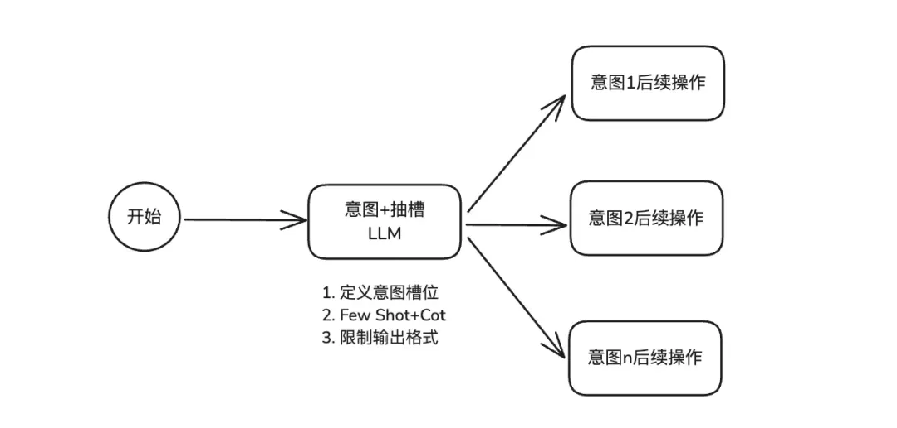
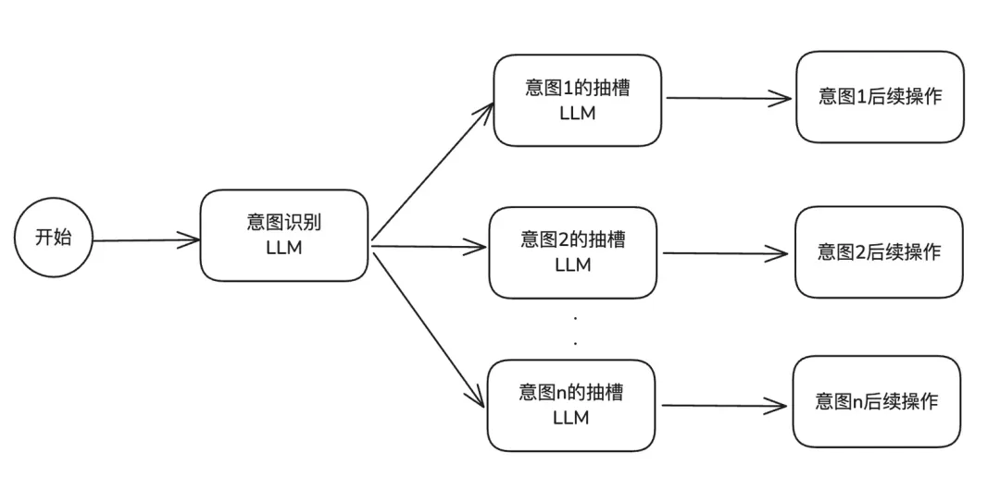
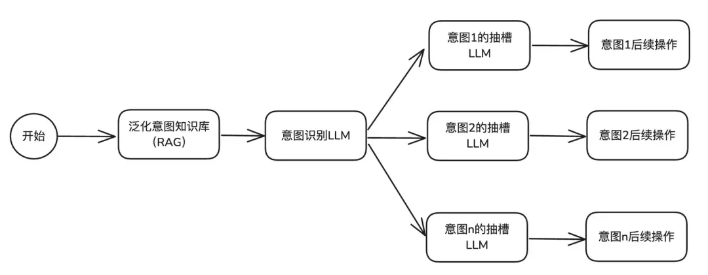
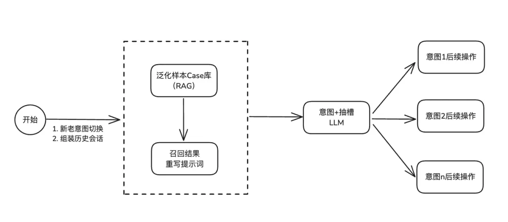

## 意图识别方案迭代

### 1. 提示词工程 + LLM

关键点：定义意图槽位 + 每个意图和槽位的 Few-Shot + CoT + 结构化格式JSON输出识别结果 + qwen3-max

优点：简单

缺点：意图数量增多时，提示词长度膨胀，3s以上

### 2. 意图识别和抽槽节点分离

优点：各意图分离，单独进行抽槽

缺点：AI调用次数增多，qwen3-max，慢

### 3. 前置意图Rag召回

​	在知识库里上传大量意图分类知识， 用户提问时，先用 RAG 召回找到相似的 query 和意图对应关系，作为案例提交给 LLM 处理，让大模型更好地理解垂类或个性化分类判定逻辑

优点：仅需通过添加知识库条目的方式，就能快速实现对bad case的覆盖，qwen3-plus

缺点：需要综合多轮信息来综合判断意图的场景下，效果不够理想

### 4. 合并意图抽槽节点 + 升级前置Rag召回能力

关键点：意图及槽位CASE管理 + 组装历史会话召回 + 降低意图响应延迟策略 + 新老意图切断策略

缺点：需要对数据进行泛化预处理，工作量大

优点：效果好
